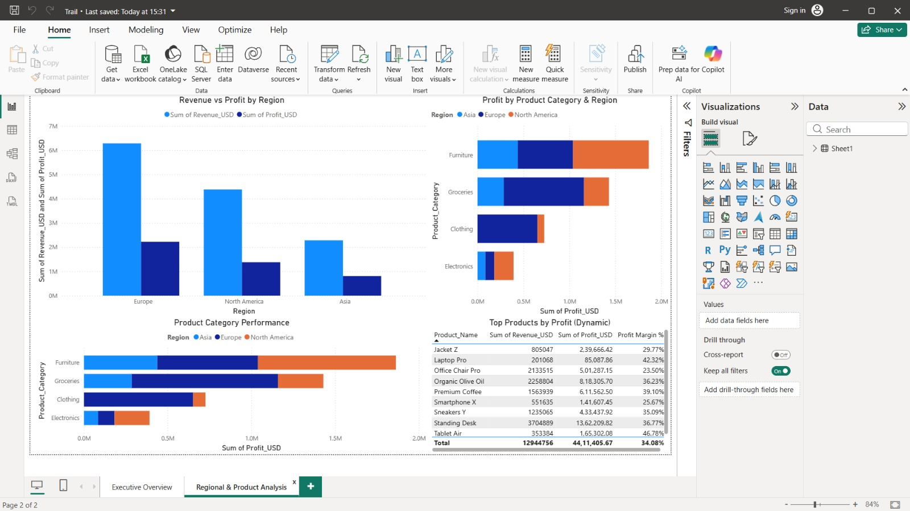

# Global Sales Performance Dashboard (Power BI)

## 📊 Project Overview
This project is an interactive Power BI dashboard built to analyze sales performance, profitability, and product trends across regions and sales channels.

The dashboard is designed for executive and business users to quickly understand key metrics and drill down into regional and product-level insights.

---

## 🧩 Dashboard Pages

### 1️⃣ Executive Overview
- KPI cards for Revenue, Profit, Profit Margin, and Units Sold
- Revenue & Profit trend analysis
- Profit by Region
- Revenue by Sales Channel
- Top Products performance

---

### 2️⃣ Regional & Product Analysis
- Revenue vs Profit by Region
- Profit by Product Category and Region
- Product Category performance
- Dynamic Top Products table

---

## 🔧 Tools & Skills Used
- Power BI Desktop
- DAX (Calculated Measures)
- Data Modeling
- KPI Design
- Interactive Slicers
- Business Analytics & Visualization

---

## 📁 Files in Repository
- `Global_Sales_Performance_Dashboard.pbix` – Power BI report file
- Dashboard screenshots
- README documentation

---

## 🚀 How to Use
1. Download the `.pbix` file
2. Open in Power BI Desktop
3. Interact with slicers to explore insights

---

## 📌 Notes
This project uses a sample sales dataset for demonstration purposes.
